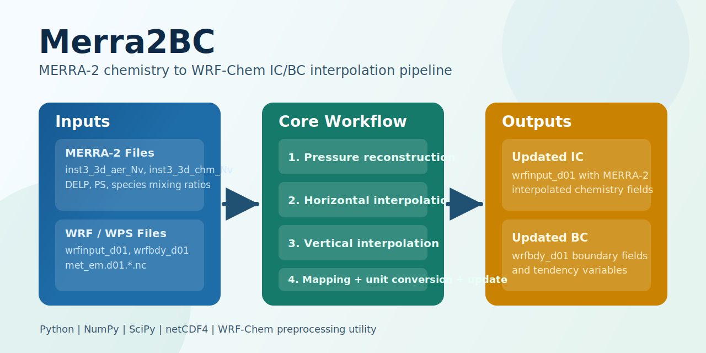

[](https://zenodo.org/badge/latestdoi/183694240)

# Merra2BC

<p align="center">
  
</p>

Merra2BC interpolates MERRA-2 chemical species to the WRF-Chem grid and updates:
- initial conditions (`wrfinput_d01`)
- time-varying boundary conditions (`wrfbdy_d01`)



## Requirements
- Python 3
- [`numpy`](https://numpy.org/)
- [`scipy`](https://scipy.org/)
- [`netCDF4`](https://github.com/Unidata/netcdf4-python)
- WRF/WPS outputs from your case setup:
  - `wrfinput_d01`
  - `wrfbdy_d01`
  - `met_em.d01.*.nc`
- MERRA-2 files covering the full simulation period and spatial domain

Install Python dependencies (pip):

```bash
python3 -m pip install -r requirements.txt
```

Or create a Conda environment from the included file:

```bash
conda env create -f environment.yml
conda activate merra2bc
```

## Configuration Model
Defaults are defined in `src/config.py`:
- species mapping (`spc_map`)
- file paths and filename masks
- whether to process IC/BC by default (`do_IC`, `do_BC`)

At runtime, command-line flags can override these defaults without editing the file.

## Quick Start
1. Run `real.exe` with `chem_in_opt = 0` to generate `wrfinput_d01` and `wrfbdy_d01`.
2. Download required MERRA-2 collections:
   - [M2I3NVAER_5.12.4](https://disc.gsfc.nasa.gov/datasets/M2I3NVAER_5.12.4/summary)
   - [M2I3NVCHM_5.12.4](https://disc.gsfc.nasa.gov/datasets/M2I3NVCHM_5.12.4/summary)
3. Update `src/config.py` defaults (especially `spc_map`, paths, and masks).
4. Zero relevant chemistry fields before interpolation:
   ```bash
   python3 zero_fields.py --do_IC=true --do_BC=true
   ```
5. Run interpolation:
   ```bash
   python3 main.py
   ```
6. Before running `wrf.exe`, in `namelist.input` under `&chem` set:
   - `have_bcs_chem = .true.` for boundary conditions
   - `chem_in_opt = 1` for initial conditions
7. Run `wrf.exe`.

## Command-line Interface
Print all options:

```bash
python3 main.py --help
```

`main.py` supported options:
- `--wrf_input_file` (full path to `wrfinput_d01`)
- `--wrf_bdy_file` (full path to `wrfbdy_d01`)
- `--wrf_met_files` (full-path glob mask for `met_em` files)
- `--merra2_files` (full-path glob mask for MERRA2 files)
- `--do_IC=true|false`
- `--do_BC=true|false`

Important:
- Quote glob masks passed to `--wrf_met_files` and `--merra2_files` to prevent shell expansion.
- Use one MERRA collection per run (`inst3_3d_aer_Nv` or `inst3_3d_chm_Nv`) consistent with the active `spc_map`; do not mix both collections in one mask.

Example (explicit paths, process both IC and BC):

```bash
python3 main.py \
  --wrf_input_file /path/to/wrf/run/wrfinput_d01 \
  --wrf_bdy_file /path/to/wrf/run/wrfbdy_d01 \
  --wrf_met_files '/path/to/wps/run/met_em.d01.2010-*' \
  --merra2_files '/path/to/merra/MERRA2_*.nc4' \
  --do_IC=true --do_BC=true
```

Example (boundary conditions only):

```bash
python3 main.py --do_IC=false --do_BC=true
```

`zero_fields.py` uses a fixed zero value (`1e-16`) and supports shared config overrides, including `--wrf_input_file`, `--wrf_bdy_file`, `--do_IC=true|false`, `--do_BC=true|false`. The fields zeroed should be the same WRF fields that are updated later by `main.py` (based on the active `spc_map`).

```bash
python3 zero_fields.py \
   --wrf_input_file /path/to/wrf/run/wrfinput_d01 \
   --do_IC=true

OR

python3 zero_fields.py \
   --wrf_bdy_file /path/to/wrf/run/wrfbdy_d01 \
   --do_BC=true
```

## Notes
- Interpolated values are added to existing WRF-Chem fields.
- Running `zero_fields.py` before `main.py` is recommended to avoid double counting.

## Citation
If this utility is useful in your research, please cite:

Ukhov, A., Ahmadov, R., Grell, G., and Stenchikov, G.: Improving dust simulations in WRF-Chem v4.1.3 coupled with the GOCART aerosol module, Geosci. Model Dev., 14, 473–493, https://doi.org/10.5194/gmd-14-473-2021, 2021.
